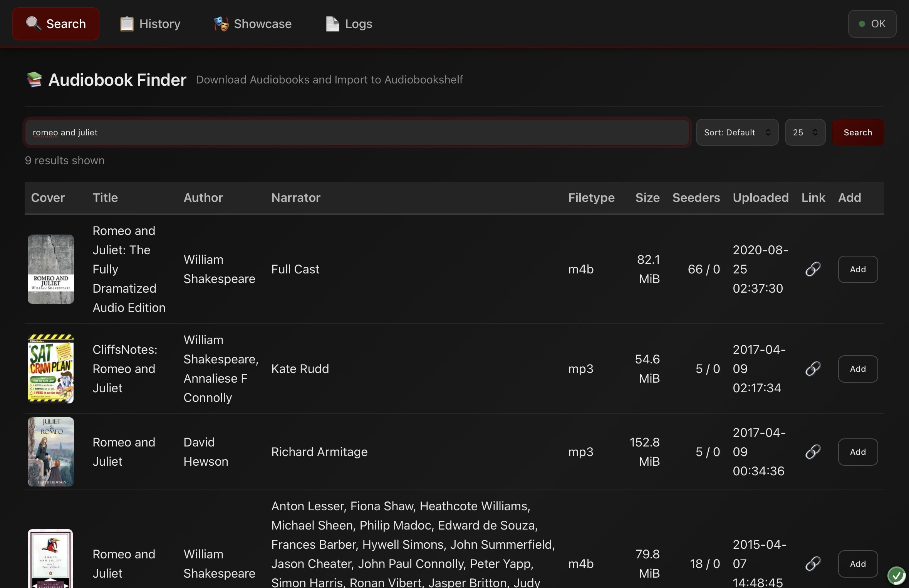
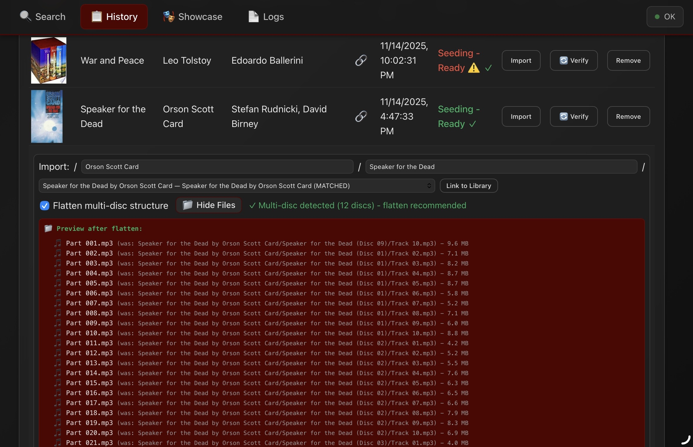
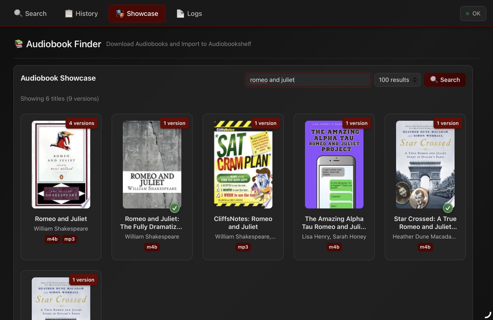

# ShelfArr

ShelfArr is an audiobook first management application for searching MyAnonamouse, adding torrents to qBittorrent, and importing completed downloads into Audiobookshelf, with asperations to become a full fledge management tool.

Orginally forked from raygan/mam-audiofinder and theoretically compatible for upgrading to. Thank you Raygan for the original idea.





Screenshots above reflect the Vue 3 + Naive UI SPA views.

## Table of Contents
- [Architecture Overview](#architecture-overview)
- [Features](#features)
- [Quick Start](#quick-start)
  - [Repository Layout](#repository-layout)
  - [1. Clone & Configure](#1-clone--configure)
  - [2. Edit `.env` File](#2-edit-env-file)
  - [3. Frontend Build Workflow](#3-frontend-build-workflow)
  - [4. Start Container](#4-start-container)
  - [5. Open Browser](#5-open-browser)
- [Configuration](#configuration)
  - [Required Environment Variables](#required-environment-variables)
  - [Optional - Audiobookshelf Integration](#optional---audiobookshelf-integration)
  - [Optional - Behavior](#optional---behavior)
  - [Optional - Container Settings](#optional---container-settings)
- [How to Use](#how-to-use)
  - [Search for Audiobooks](#search-for-audiobooks)
  - [Add to qBittorrent](#add-to-qbittorrent)
  - [Import to Audiobookshelf](#import-to-audiobookshelf)
  - [Browse with Showcase View](#browse-with-showcase-view)
- [Important Notes](#important-notes)
  - [Security](#security)
  - [Path Mapping](#path-mapping)
  - [Multi-Disc Audiobooks](#multi-disc-audiobooks)
  - [Import Verification](#import-verification)
- [Troubleshooting](#troubleshooting)
- [Logs](#logs)
- [Technical Documentation](#technical-documentation)
- [Requirements](#requirements)
- [License](#license)

## Architecture Overview
- **SPA entrypoint:** Vite builds land in `app/static/dist/` with `index.html` served for all non-API routes. FastAPI mounts `/static` and provides the SPA fallback in `app/main.py`.
- **Backend role:** FastAPI exposes API routes under `app/routes/` (`/search`, `/history`, `/import`, `/qb`, `/logs`, `/series`, `/covers`, `/config`, `/health`) and defers HTML to the SPA index.
- **Routing:** Vue Router runs in history mode with a catch-all redirect for unknown paths. Deep links and refreshes resolve through the FastAPI fallback.
- **Styling system:** UnoCSS atomic utilities with custom shortcuts (uno.config.js), global CSS custom properties in `build/frontend/src/styles/global.css`, component-scoped styles in Vue `<style>` blocks, and Naive UI theme overrides in `build/frontend/src/theme/naive.js`.

## Features
- **Vue SPA views:** Search, History (imports + verification), Showcase, Logs, and Series all run as Vue Router pages with Naive UI components.
- **Search MAM:** Find audiobooks by title, author, or narrator with inline cover loading and “already in library” indicators.
- **Add to qBittorrent:** One-click torrent submissions with configurable category and optional post-import category change.
- **Import to Audiobookshelf:** Link/copy/move completed downloads, flatten multi-disc layouts, and verify imports automatically.
- **Showcase grid:** Browse grouped editions in a visual grid with quick add actions.
- **Series discovery:** Explore series metadata via Hardcover with sortable data tables.
- **Automatic verification:** ABS-backed verification badges and logs to track import health.

## Quick Start

### Repository Layout
- `app/` – FastAPI backend, static asset mount, SPA fallback, API routers.
- `build/frontend/` – Vue 3 + Vite workspace (scripts in `package.json`).
- `docs/` – Technical docs, migration notes, screenshots.
- `data/` – Runtime volume for databases, logs, covers (mounted in Docker).

### 1. Clone & Configure
```bash
git clone https://github.com/magrhino/shelfarr.git
cd shelfarr
cp env.example .env
```

### 2. Edit `.env` File

**Required settings:**
```bash
# MAM session cookie (get from browser DevTools)
MAM_COOKIE=mam_id=your_cookie_here

# qBittorrent WebUI
QB_URL=http://qbittorrent:8080
QB_USER=youruser
QB_PASS=yourpass

# Storage paths (host paths)
MEDIA_ROOT=/path/to/media
DATA_DIR=/path/to/appdata/shelfarr
```

**Optional - Enable Audiobookshelf features:**
```bash
ABS_BASE_URL=http://audiobookshelf:13378
ABS_API_KEY=your_api_key_here
```

### 3. Start Container
```bash
docker compose up -d --build
```

### 4. Open Browser
Visit [http://localhost:8008](http://localhost:8008). All non-API routes render the Vue SPA; Vue Router handles client-side navigation.

## Configuration

### Required Environment Variables

| Variable | Description | Example |
|----------|-------------|---------|
| `MAM_COOKIE` | Your MAM session cookie (use ASN-locked cookie) | `mam_id=abc123...` |
| `QB_URL` | qBittorrent WebUI URL | `http://qbittorrent:8080` |
| `QB_USER` | qBittorrent username | `admin` |
| `QB_PASS` | qBittorrent password | `password123` |
| `MEDIA_ROOT` | Host path containing both torrents and library | `/mnt/storage` |
| `DATA_DIR` | Host path for app data (databases, logs, covers) | `/path/to/appdata/shelfarr` |

### Optional - Audiobookshelf Integration

| Variable | Default | Description |
|----------|---------|-------------|
| `ABS_BASE_URL` | *(none)* | Audiobookshelf URL for cover images and verification |
| `ABS_API_KEY` | *(none)* | Audiobookshelf API token |
| `ABS_LIBRARY_ID` | *(none)* | Specific library ID to search (optional) |
| `ABS_CHECK_LIBRARY` | `true` | Show "already in library" indicators on search results |
| `MAX_COVERS_SIZE_MB` | `500` | Max disk space for cover cache (0 = no cache) |

**When ABS is configured, you get:** cover images, automatic import verification, library indicators, and description display pulled from Audiobookshelf metadata.

### Optional - Behavior

| Variable | Default | Description |
|----------|---------|-------------|
| `IMPORT_MODE` | `link` | Import method: `link` (hardlink), `copy`, or `move` |
| `FLATTEN_DISCS` | `true` | Flatten multi-disc audiobooks to sequential files |
| `QB_CATEGORY` | `shelfarr` | Category assigned to new torrents |
| `QB_POSTIMPORT_CATEGORY` | *(none)* | Category to set after import (empty = remove category) |
| `APP_PORT` | `8008` | Host port for web interface |

### Optional - Container Settings

| Variable | Default | Description |
|----------|---------|-------------|
| `DL_DIR` | `/media/torrents` | In-container path for qBittorrent downloads |
| `LIB_DIR` | `/media/Books/Audiobooks` | In-container path for Audiobookshelf library |
| `PUID` | `1000` | Container user ID (for file permissions) |
| `PGID` | `1000` | Container group ID (for file permissions) |
| `UMASK` | `0002` | File creation mask |
| `LOG_MAX_MB` | `5` | Max log file size before rotation (MB) |
| `LOG_MAX_FILES` | `5` | Number of rotated log files to keep |

See `env.example` for full configuration with comments.

## How to Use

### Search for Audiobooks
1. Open the **Search** view in the Vue SPA.
2. Enter title, author, or narrator then run the search.
3. Results stream in with covers and “already in library” indicators (ABS).
4. Use action buttons to add torrents or view details.

### Add to qBittorrent
1. From **Search** or **Showcase**, click **Add** on a result.
2. Torrent is added to qBittorrent with the configured category.
3. Entry appears in the **History** view with status badges.

### Import to Audiobookshelf
1. Open the **History** view.
2. Wait for the download status to reach completed (qBittorrent).
3. Click **Import**, choose destination, and confirm flattening if multi-disc.
4. Import links/copies/moves files as configured, then verification runs.
5. Status badges reflect verification state (Verified, Mismatch, Not Found, Unreachable).

### Browse with Showcase View
1. Open **Showcase** to see grouped editions in a grid.
2. Filter or search within the Vue view; navigation stays in-app (no full reloads).
3. Click a card for versions and add any release to qBittorrent.

## Important Notes

### Security
ShelfArr has no built-in authentication. Run on a private network, behind a VPN, or behind an authenticated proxy.

### Path Mapping
The app and qBittorrent run in separate containers. `MEDIA_ROOT` must be mounted to both containers at consistent paths so imports can find completed downloads.

### Multi-Disc Audiobooks
When `FLATTEN_DISCS=true`, imports reorganize multi-disc structures into a single flat sequence suitable for Audiobookshelf. Disable to preserve original layout.

### Import Verification
With ABS configured, imports trigger verification and display badges in the **History** view. Retry via the **Verify** action if ABS scans lag.

## Troubleshooting
- **Import fails with "path not found":** Confirm `MEDIA_ROOT` mounts match between containers and that `DL_DIR`/`LIB_DIR` align with qBittorrent and Audiobookshelf paths.
- **Permission errors:** Ensure `PUID`, `PGID`, and `UMASK` match your host user/group; rebuild the container after changes.
- **Covers not loading:** Verify `ABS_BASE_URL` and `ABS_API_KEY`, check reachability from the container, and tail application logs.
- **Verification always "not_found":** Allow ABS time to rescan after imports, then use **Verify** in **History**.
- **MAM searches fail:** Refresh your MAM cookie and restart the container.

## Logs
- In-app: open the SPA **Logs** view at `/logs` (rendered by Vue, fed by API).
- CLI: `docker compose logs -f` or tail log files in the mounted `DATA_DIR`.

## Technical Documentation
- `docs/BACKEND.md` – FastAPI architecture, routing, dependencies, and SPA fallback behavior.
- `docs/FRONTEND.md` – Vue SPA architecture, routing map, components, styling, and Naive UI theme.
- `docs/TESTING.md` – Testing guide: local and container-based testing, Selenium integration.
- `docs/jinja_migration_changes.md` – SPA migration notes and fallback routing details.
- `docs/css_refactoring_summary.md` – CSS architecture (main.css, legacy.css, global.css, scoped styles, Naive UI theme).

## Requirements
- Docker & Docker Compose
- qBittorrent with WebUI enabled
- Valid MAM session cookie
- (Optional) Audiobookshelf instance for covers and verification

## License
MIT - Provided as-is, no warranty. Personal-use tooling only.
